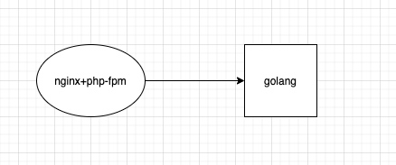

# 记一次内存报警的调试

## 背景

由于这个业务从上个离职人员那里接手过来的，代码架构比较冗余，有 `php` 和 `golang` 两套，php 做业务网关收到请求转发到 golang 做处理（我也是醉了。。）

过年期间某天早上 9 点多收到报警邮件，业务机器的内存不足 10%了; 其实之前在公司时就从 `grafana` 上发现过内存持续增长的问题; 刚开始以为是 `golang` 程序的内存泄露，而且确实用 `pprof` 调试后发现 `heap` 空间持续增长没有减少，但是 `goruotine` 数量一直正常，一直也没找到问题，但是每次重启 `golang` 程序后内存都会得到大量释放。

由于之前经常迭代，所以相当于定期手动释放了内存，也没什么问题，就放一边没理会，这次春节放的时间比较长，问题就爆发了。

## 找原因

这次告警了干脆想把问题原因找到，登陆服务器想查看当前 golang 程序占多少内存，一看才 700M，不多啊，怎么吃掉了 2G 呢？再看哪个进程占内存最多，发现 100 个fpm 总共占了近 4 个 G，我想我们这个业务没什么量啊，平均每分钟才 200 个请求，开这么多 fpm 干嘛，而且我们 3 台机器 LB 呢，就让运维把 `pm.max_children`的值调到 50，调完重启后内存瞬间释放掉 2G，告警就恢复了; 但是过了几天我再看`grafana`内存还是再不断的增长，到底是哪里吃的内存呢？Google 发现 fpm 是不会在请求处理完后就把内存还给系统的，而是等到`pm.max_requests`值的请求处理完后重启这个 fpm 子进程才会释放内存给系统，所以总结出下面这个公式 

`(每天的总请求量*天数)-(每个fpm的pm.max_requests值*pm.max_children的值*机器数) > 0 `

满足这个共识的时候所有的fpm就重启过了，比方我这个业务每天总共收到请求是200000个，fpm设置的pm.max_requests值是10240，pm.max_children设置的值是50，机器数是3，那经过8天运行后3台机器上的fpm就都重启过了，内存应该释放出来了

于是我就等过了 8 天后再看`grafana`，果然内存在某个时间点释放出来了，当时并没有人做过什么操作，所以应该是 fpm 自动重启使得内存释放了。

## 后续

到这里其实是个 fpm 没有合理配置而产生的问题，经过调优后应该可以解决，但是我发现虽然 fpm 重启后内存释放了，但是每次释放后的内存却总是比之前少，说明还有进程存在内存泄露，可能就是那个`golang`程序了，调试的道路还在继续。。。。